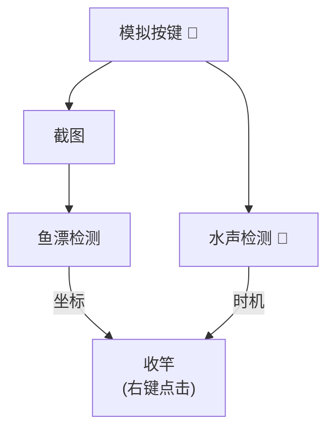
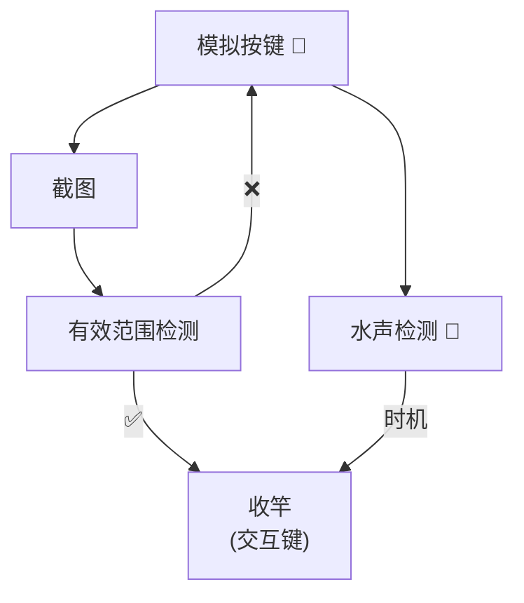

# WoW Fishing Agent 魔兽世界钓鱼

> The main target is Chinese users, if you are interested, please use the translation software, I am too lazy to write English introduction.

本项目旨在通过非侵入的方式，用机器学习的方式来做一个自动钓鱼的工具。

# 1. 准备

- Windows(Ubuntu现在还登录不了国服游戏, Mac应该可以)
- 使用虚拟声卡或者立体混响将游戏声音从输出变成输入，可选工具 [Virtual Audio Cable](https://vac.muzychenko.net/en/download.htm), [VB-Audio](https://vb-audio.com/Voicemeeter/index.htm)
- Python >= 3.10
- 标注数据：使用 [anylableling](https://github.com/vietanhdev/anylabeling) 或其它工具标一下自己的截图，截图按一下`Print Screen`键在游戏目录下就会生成一张。 

```bash
pip install -r requirements.txt

python -m fishing
```

# 2. 流程介绍

代码很简单，介绍一下工作流程。

一般的无插件的正常流程


使用了 WA(Fishing Helper) 之后会引入有效范围的提示，检测它就能够避开鱼漂检测（目前数据太少，鱼漂的置信度有点低，也不难）。


# 3. 一些问题
1. 目前训练数据还是太少了，才10张，需要收集更多。
2. 水声作为识别依据一是没有对水声事件进行标注，天然就差了一些，二是要是有人跟你一起钓就凉了。
3. （低优先级）流程上可以将不在有效范围时，直接去点坐标的流程也实现了，节约一次甩杆。
4. 项目使用可能需要调整一些参数，还未达到即开即用的程度。

# 4. 致谢

1. [robertanto/Real-Time-Sound-Event-Detection](https://github.com/robertanto/Real-Time-Sound-Event-Detection) 项目的yamnet封装和实现
2. [Virtual Audio Cable](https://vac.muzychenko.net/en/download.htm) 虚拟声卡
3. WA (Fishing Helper) 新手盒子，DD上面都有
4. YOLO: 特征抽取能力真的强，13年前用SIFT提的特征准确率只有30%
5. [moses-palmer/pynput](https://github.com/moses-palmer/pynput) 用来操作鼠标了