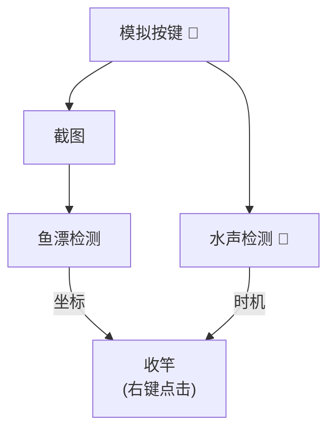
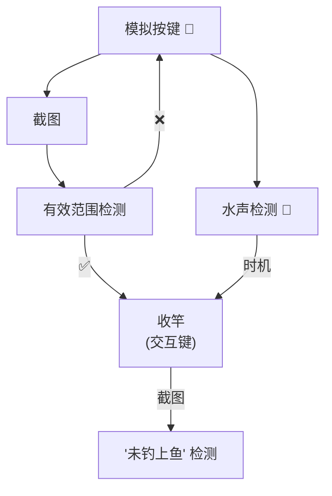

# WoW Fishing Agent 魔兽世界钓鱼

> The main target is Chinese users, if you are interested, please use the translation software, I am too lazy to write English introduction.

本项目旨在通过非侵入的方式，用机器学习的方式来做一个自动钓鱼的工具。

# 0. 更新

## 2024/12/08
- 增加使用键盘按键暂停的功能

## 2024/12/05
- 增加只做水声检测的流程

## 2024/12/01
- 音频检测：
  1. 新增从loopback读取，不再需要虚拟声卡支持
  2. 新增根据钓鱼的施放和点击获取样本的功能
  3. 新增负样本采集功能，有基本的启动样本之后（10+段即可），对于背景可以采集预测为1的样本直接作为负样本
  4. 从直接使用yamnet更改为使用facebook/wav2vec2-base
- 目标检测：
  1. 标注数据改用[label-studio](https://labelstud.io/) 打通YOLO的训练与预测更容易了
  2. 调整了训练时的检测尺寸至1920，避免小尺寸的收缩成了一个点，丧失分辨能力
  3. 增加了“没有鱼上钩”的提示的识别
- 增加数据闭环
  1. 正样本：在一次钓鱼期间没有检测到水声，则保存此样本至`datasets/record/miss-bite` (还需要手动去掉非水声)
  2. 负样本：点击收鱼后，如果检测到了“没有鱼上钩”，则保存样本至`dataset/record/wrong-bte`
- 流程：
  1. 增加样本收集
- 更新完成之后，目前已经能够自动收集音频负样本数据了，对于整体系统的迭代还是有正向意义的。基本已经完成了做一个可学习的系统的目的。

# 1. 准备

1. Windows(Ubuntu现在还登录不了国服游戏, Mac未尝试)
2. Python == 3.10 （其它未测试，应该差不多）
3. 使用[label-studio](https://labelstud.io/)做图像目标检测，借助音频数据采集代码采集音频识别数据
4. 或者也可以通过百度网盘获得这边训练的模型和训练数据 [wow-fisher-data](https://pan.baidu.com/s/1AVfh9TD9xmA__V27BWcHuA?pwd=zytv)
   - 图像参考意义有限，这边用了NDui，字体变了
   - 水声是音频识别，应该能复用。
5. 准备模型
   - 声音事件检测模型，放到 `models/bite_model`下，目录起名可以是`checkpoint-1`，也可以在参数中指定
   - 图像目标检测模型，放到 `models/od`下，可以起名叫`best.pt`，也可以在参数中指定

```bash
poetry install

python -m fishing
```

# 2. 使用说明

待补充

# 3. 流程介绍

代码很简单，介绍一下工作流程。

一般的无插件的正常流程


使用了 WA(Fishing Helper) 之后会引入有效范围的提示，检测它就能够避开鱼漂检测（目前数据太少，鱼漂的置信度有点低，也不难）。


# 4. 一些问题
1. 水声作为识别在有人跟你一起钓的情况下并不能作为判定依据，此时无法工作。
2. 在有水流声的时候仍然需要微调，都是水声要区分开来需要更多的样本，有水声的样本目前只在达拉然喷泉收集了一些
3. （低优先级）流程上可以将不在有效范围时，直接去点坐标的流程也实现了，节约一次甩杆。
4. 包满了之后会自动停止（其实是卡住了停的）
5. 仅在怀旧服上有真实使用案例，其它的未测试。

# 5. 致谢
1. 使用 facebook/wav2vec2 用来作为了特征抽取的底座
2. WA (Fishing Helper) 新手盒子，DD上面都有
3. YOLO: 特征抽取能力真的强，13年前用SIFT提的特征准确率只有30%
4. [moses-palmer/pynput](https://github.com/moses-palmer/pynput) 用来操作鼠标和键盘

# 6. TODO
- 增加渔点钓鱼模式，结合渔点检测做自动暂停。（想想这样钓乌龟应该就舒服一点了）